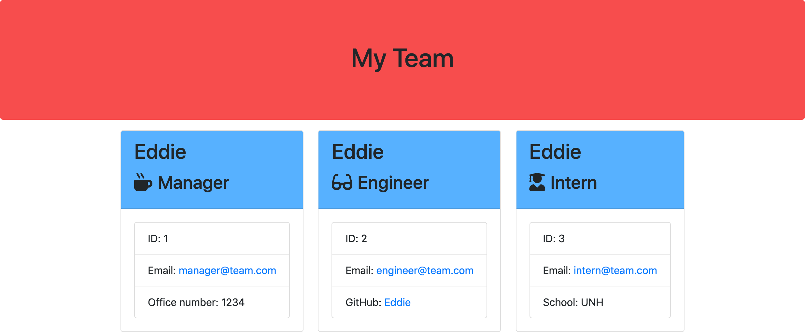

# Team-Profile-Generator

-------------------------------------------------- Personal Notes -------------------------------------------------

Deployed GitHub Pages Link: https://eddiephi.github.io/EddiePhiPortfolio/

Description:
I built a command line application using HTML, JavaScript, and Node.js. After inputs have been entered into the CLI by the user, an HTML page is rendered containing information regarding individual team members with details reflecting user input. I developed unit testing using Jest.

Screenshot:

Video Demo:
https://drive.google.com/file/d/19JsEohHYmh7n6AqmI5kAAUh-7oU4d96L/view 

Technologies: HTML5, CSS3, Bootstrap, JavaScript, Node.js, NPM (Jest, Inquirer)

License: MIT

I used https://validator.w3.org/nu/ to validate my work.

---------------------------------------------------- Contact ----------------------------------------------------

Email: ephimansone@gmail.com 

LinkedIn: https://linkedin.com/in/eddiephi

GitHub: https://github.com/EddiePhi

Portfolio: https://eddiephi.github.io/EddiePhiPortfolio/

